# BudgetWise – AI Driven Expense Tracker and Budget Advisor

BudgetWise is a comprehensive, intelligent financial management platform designed to help users take total control of their money. By combining smart expense tracking, goal-oriented budgeting, and AI-powered financial insights, BudgetWise empowers users to manage their finances with clarity and confidence.

---

## 📸 Screenshots

### 🏠 Welcome & Authentication
| Landing Page | Sign In | Sign Up |
|:---:|:---:|:---:|
| 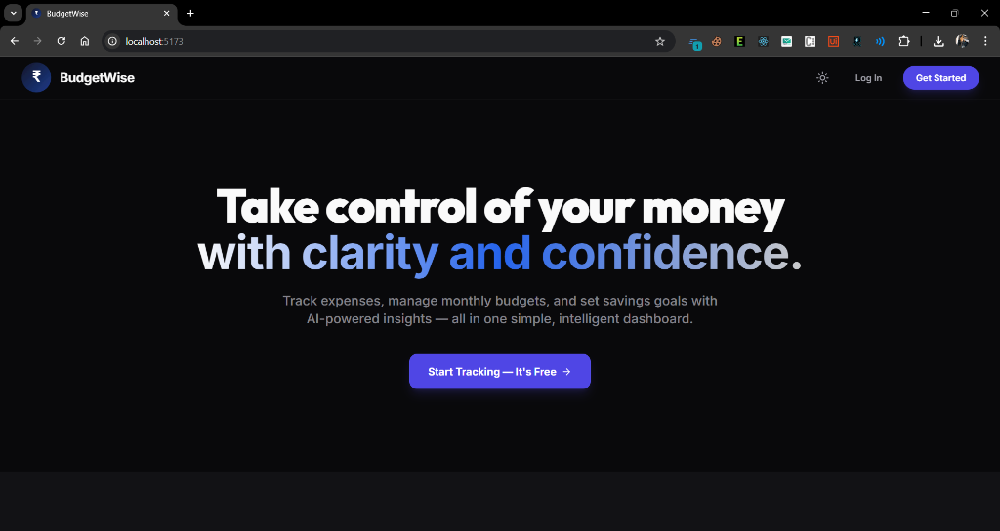 |  | 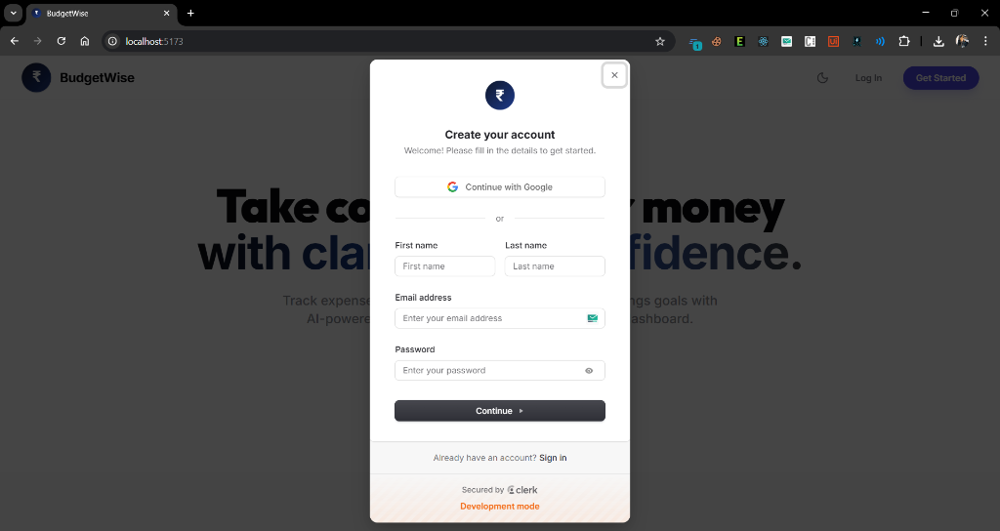 |

### 📊 Dashboard & Profile
| Main Dashboard | User Profile |
|:---:|:---:|
| 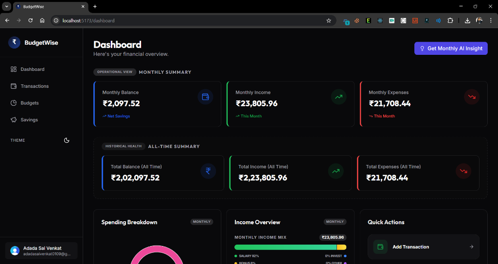 | 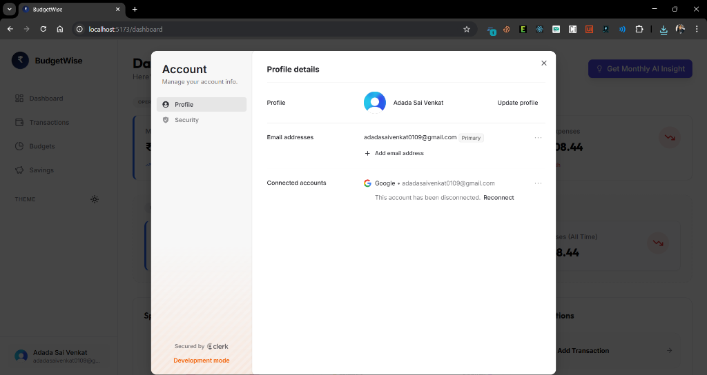 |

### 📝 Transaction Management
| Transactions History | Search & Filter |
|:---:|:---:|
| 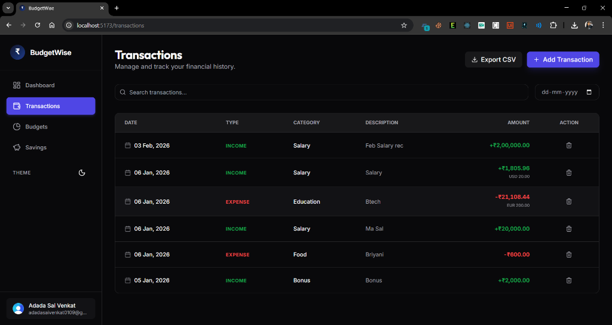 | 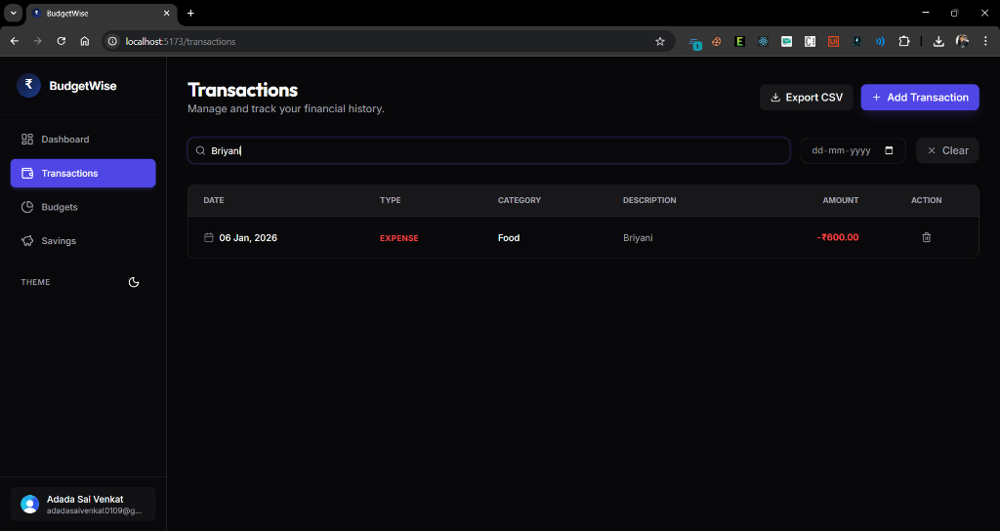 |

| Delete Confirmation | CSV Export Preview |
|:---:|:---:|
| 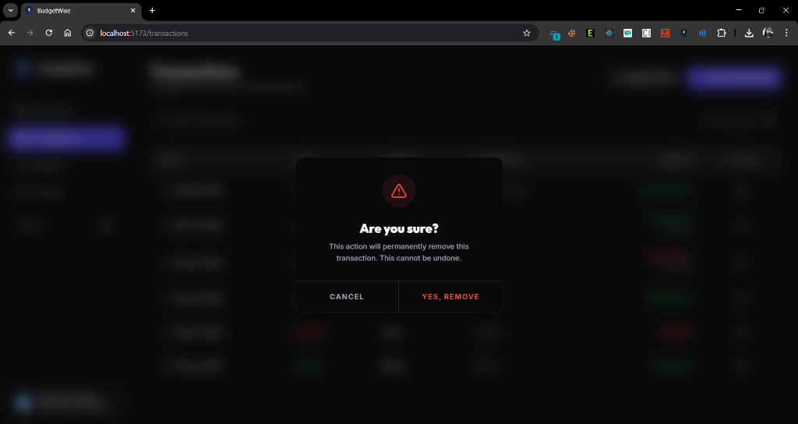 | 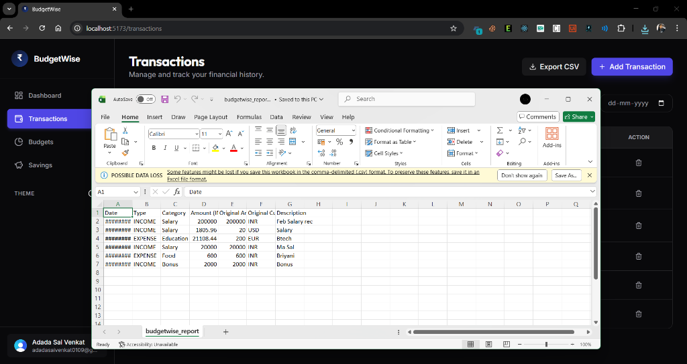 |

### 🎯 Budgeting & Savings
| Monthly Budgets | Edit Budget |
|:---:|:---:|
| 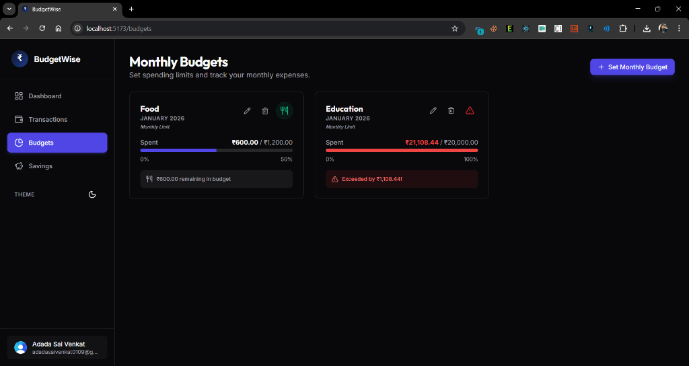 | 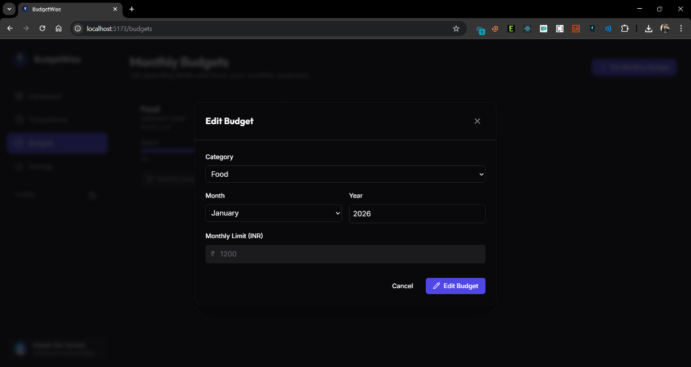 |

| Savings Goals | Edit Savings Goal |
|:---:|:---:|
| 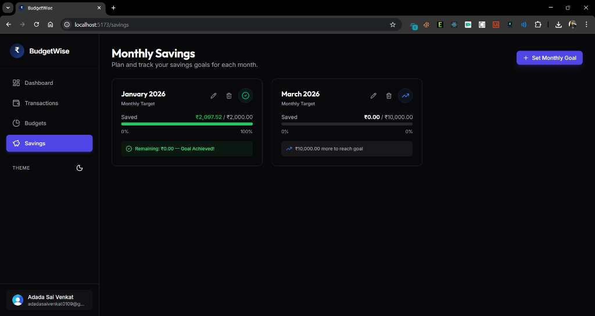 | 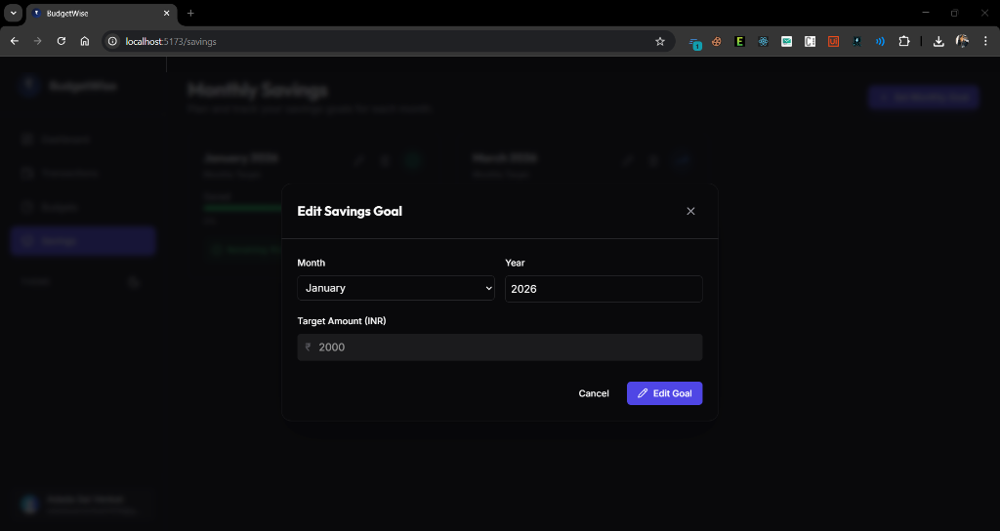 |

### ✨ Process & Conclusion
| How It Works | Call to Action |
|:---:|:---:|
| 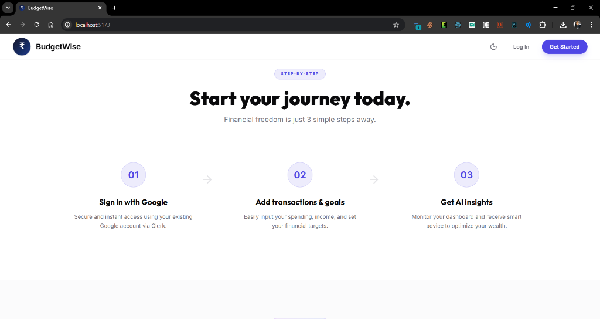 | 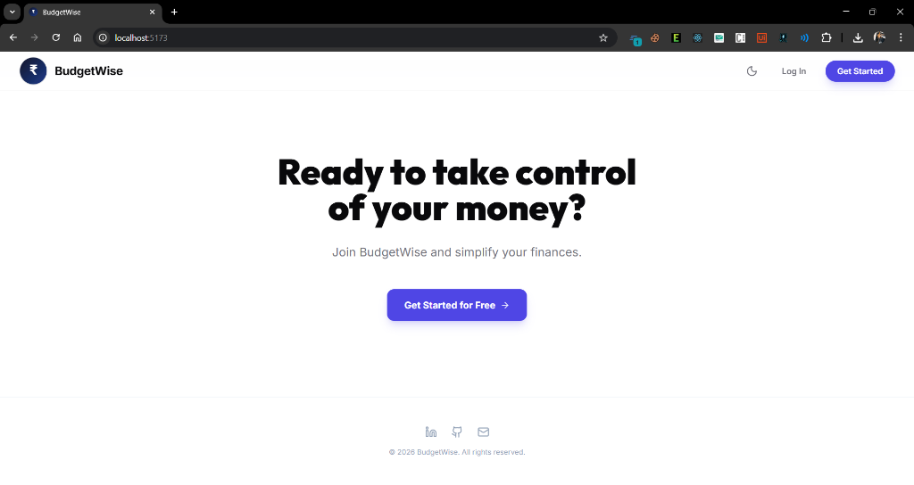 |

---

## 🎥 Demo Video

> [!IMPORTANT]
> **Watch the full platform walkthrough on Google Drive:**
> 
> 🔗 **Public Link:** [Watch Demo on Google Drive](https://drive.google.com/file/d/1rLsCUkM1IRon998fwx9Ovd7q0Xli8uyy/view?usp=drive_link)
> 
> *The demo video showcases the platform's core functionality, including transaction logging, budget setting, and AI insights.*

---

## 🚀 Features

- **Smart Expense Tracking**: Effortlessly log and monitor all your income and expenses in one central location.
- **Monthly Budgets**: Set category-wise spending limits and receive alerts to stay on track throughout the month.
- **Savings Goals**: Define and track progress towards your financial targets with dedicated savings management.
- **AI Financial Insights**: Receive personalized, intelligent suggestions powered by Gemini AI to optimize your spending and saving habits.
- **Global Multi-Currency Support**: Transact in USD, EUR, or GBP with automatic conversion to INR for seamless tracking.
- **Visual Analytics**: Gain deep insights into your financial health through interactive charts and visualizations.
- **Data Portability**: Maintain full ownership of your data with easy export functionality to CSV format.

## 🛠 Tech Stack

### Frontend
- **Framework**: React.js
- **Styling**: Tailwind CSS, Framer Motion (Animations)
- **State Management & Routing**: React Router DOM
- **Authentication**: Clerk (with Google OAuth)
- **Charts**: Recharts
- **Icons**: Lucide React
- **Editor**: VS Code

### Backend
- **Framework**: Java, Spring Boot
- **Security**: Spring Security (OAuth2 Resource Server for Clerk integration)
- **Database**: MySQL
- **ORM**: Spring Data JPA
- **AI Integration**: Gemini API (via Google GenAI Java SDK)
- **Editor**: IntelliJ IDEA

### Tools & Support
- **Database Tools**: MySQL Workbench, phpMyAdmin
- **AI Resources**: Gemini API

---

## 📦 Modules

1. **User Authentication & Profile Management**: Secure sign-in/sign-up using Clerk with social login support and profile customization.
2. **Expense and Income Tracking**: Core functionality for logging daily transactions with category and currency support.
3. **Budget and Savings**: Tools for setting monthly spending limits and tracking progress toward savings targets.
4. **Financial Transactions & Visualization**: Interactive dashboard with real-time charts and filtered transaction history.
5. **Data Export and AI Insights**: AI-driven budget advisor providing personalized tips and CSV export for financial records.

---

## ⚙️ Setup Instructions

### Backend Setup (Spring Boot)
1. Ensure you have **Java 21** and **Maven** installed.
2. Open the `budgetwise-backend` folder in **IntelliJ IDEA**.
3. Configure your MySQL database in `src/main/resources/application.properties`.
4. Add your **Clerk** and **Gemini API** credentials to the environment variables or `application.properties`.
5. Run the application using Maven:
   ```bash
   mvn spring-boot:run
   ```

### Frontend Setup (React)
1. Navigate to the `budgetwise-frontend` directory.
2. Install dependencies:
   ```bash
   npm install
   ```
3. Create a `.env` file and add your **Clerk Publishable Key**.
4. Start the development server:
   ```bash
   npm run dev
   ```
5. Open [http://localhost:5173](http://localhost:5173) in your browser.

---

## 🎓 Acknowledgements

- **Program**: Infosys Springboard 6.0 Virtual Internship – JAVA Technology Stack
- **Mentor**: Maria Jerina Mam ([springboardmentor569@gmail.com](mailto:springboardmentor569@gmail.com))
- **Special Thanks**: To the Infosys Springboard team for their guidance and the resources provided throughout the program.
